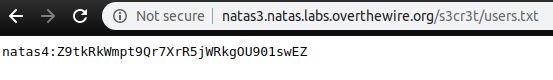

# Over the wire - Natas
Natas teaches the basics of serverside web-security.

Each level of natas consists of its own website located at http://natasX.natas.labs.overthewire.org, where X is the level number. There is no SSH login. To access a level, enter the username for that level (e.g. natas0 for level 0) and its password.

Each level has access to the password of the next level. Your job is to somehow obtain that next password and level up. All passwords are also stored in /etc/natas_webpass/. E.g. the password for natas5 is stored in the file /etc/natas_webpass/natas5 and only readable by natas4 and natas5.

## ***Level 0***
```
Username: natas0
Password: natas0
URL:      http://natas0.natas.labs.overthewire.org
```


So let's take a look at the source code:


The password for natas1 is gtVrDuiDfck831PqWsLEZy5gyDz1clto 

---


## ***Level 1***
```
Username: natas1
Password: password retrieved from previous level
URL:      http://natas1.natas.labs.overthewire.org
```


So instead of right-clicking we simply press F12 to open the developer console.


The password for natas2 is ZluruAthQk7Q2MqmDeTiUij2ZvWy2mBi


---

## ***Level 2***
```
Username: natas2
Password: password retrieved from previous level
URL:      http://natas2.natas.labs.overthewire.org
```


Looking at the source code, we indeed see, that there is nothing on this website, besides an image containing a single pixel.


However, what comes directly to my mind: the pixel is included from a relative path **/files/pixel.png**. What happens if we just go to the files directory via URL?


Let's see what's in users.txt


Bingo! the password for natas3 is sJIJNW6ucpu6HPZ1ZAchaDtwd7oGrD14

---

## ***Level 3***
```
Username: natas3
Password: password retrieved from previous level
URL:      http://natas3.natas.labs.overthewire.org
```


Well this looks familiar.... let's try to follow the same steps as before.


Meh... no more leaked info... However, the hint "Not even Google will find it this time" directly tells us where we should look, namely in the robots.txt file.

*"Robots.txt is a text file webmasters create to instruct web robots (typically search engine robots) how to crawl pages on their website. The robots.txt file is part of the the robots exclusion protocol (REP), a group of web standards that regulate how robots crawl the web, access and index content, and serve that content up to users. The REP also includes directives like meta robots, as well as page-, subdirectory-, or site-wide instructions for how search engines should treat links (such as “follow” or “nofollow”).

In practice, robots.txt files indicate whether certain user agents (web-crawling software) can or cannot crawl parts of a website. These crawl instructions are specified by “disallowing” or “allowing” the behavior of certain (or all) user agents."* https://moz.com/learn/seo/robotstxt

So let's see what's hidden there:


Following this "secret" path...


And again we have a users.txt. Let's see what's in there.



The password for natas4 is Z9tkRkWmpt9Qr7XrR5jWRkgOU901swEZ

---

## ***Level 4***
```
Username: natas4
Password: password retrieved from previous level
URL:      http://natas4.natas.labs.overthewire.org
```


Refreshing does at least tell us, that it checks for the referer head information of the request.


So we will need Burp Suite for this task here. We set it up and intercept the request from the natas4 website.


Now we have to change the Referer value within the Header, to the one that the application expects.


Now we forward the message in burp suite and will receive the password.


The password for natas5 is iX6IOfmpN7AYOQGPwtn3fXpbaJVJcHfq

---

## ***Level 5***
```
Username: natas5
Password: password retrieved from previous level
URL:      http://natas5.natas.labs.overthewire.org
```


The first steps in web challenges are always: check the source code and the cookies.

Checking the source code lead to nothing:


So let's take a look at the cookies:


There we see a cookie named "loggedin" which is set to 0... What happens I set it to 1 and refresh the page? Correct! We get the password.


The password for natas6 is aGoY4q2Dc6MgDq4oL4YtoKtyAg9PeHa1

---
